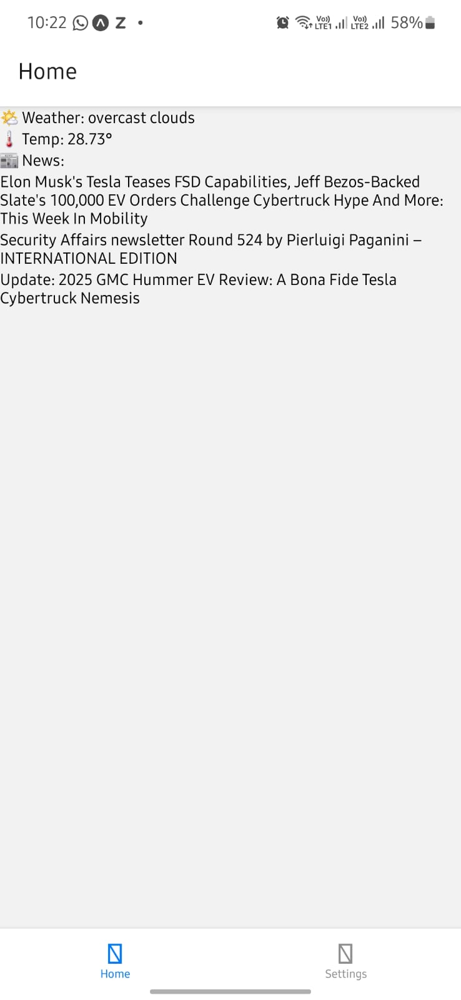
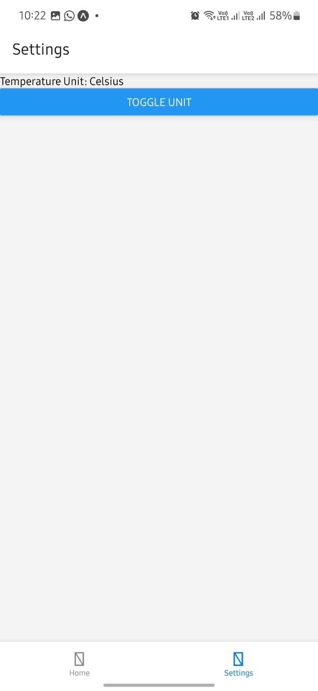

# 🌤️ Weather & News Aggregator App

A React Native app that fetches and displays **weather data** and **news headlines**, and intelligently filters news based on the current weather conditions.

---

## 🚀 Features

- 🌍 **Location-based Weather**
  - Displays current temperature and conditions
  - 5-day weather forecast (optional)
  - Uses OpenWeatherMap API

- 📰 **Live News Feed**
  - Latest headlines with descriptions and links
  - Uses NewsAPI.org

- 🧠 **Weather-Based News Filtering**
  - Cold? Shows sad/depressing news
  - Hot? Shows news related to fear/threats
  - Cool? Shows positive/uplifting news

- ⚙️ **Settings**
  - Choose temperature unit (Celsius/Fahrenheit)
  - Select preferred news categories (optional)

---

## 📦 Tech Stack

- **React Native**
- **Expo**
- **OpenWeatherMap API**
- **NewsAPI**
- **TypeScript**
- **Axios**
- **Context API** for settings

---

## 🔧 Setup Instructions

1. **Clone the repo**
   ```bash
   git clone https://github.com/yourusername/weather-news-app.git
   cd weather-news-app
## 📸 Screenshots

### 🏠 Home Screen


### 🌤️ setting View
